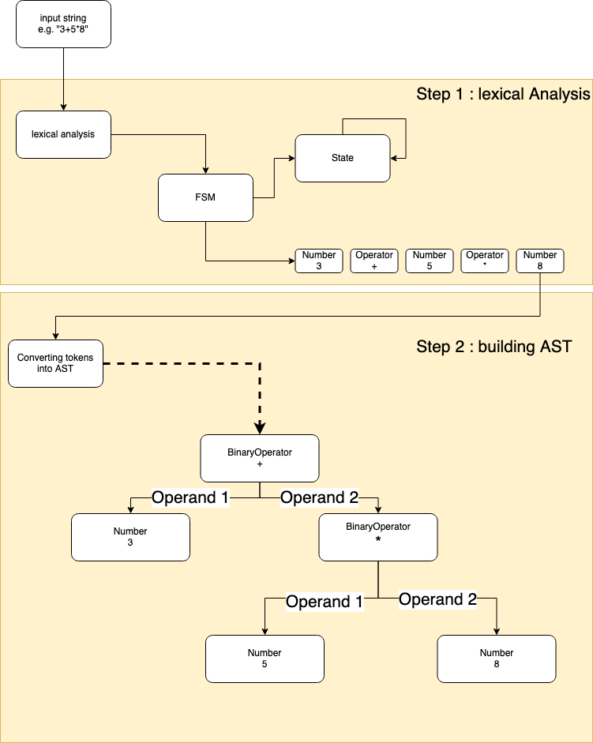

# A mathematical function parser for java

## Supported syntax

It can parse `+ - * / ^ ( )` as in `53 * 34` or `(2+3)*4^2`

It can parse `sqrt log logten sin cos tan asin acos atan` as in `sqrt(9) or cos(343)` (`log` is log to base of 2, and `logten` is log to the base of 10)

It can parse `pi e` to return the constants pi and e.

Finally it can parse any variable name matching `^\w+$`.

## How to use it

```bash
mvn compile
java -cp target/classes de.oglimmer.math.FunctionParser "((2+3)*-3)+2+x*y*sin(pi/2)" "x" "-34" "y" "3"
```

(First parameter is the function, any 2nd and 3rd is a variable and its value)

## How it works

Step 1 - the lexical analysis is done in [LexicalAnalyzer.java](src/main/java/de/oglimmer/math/token/LexicalAnalyzer.java) 
and the resulting objects are [Token.java](src/main/java/de/oglimmer/math/token/Token.java). 
Internally an [FSM.java](src/main/java/de/oglimmer/math/fsm/FSM.java) uses multiple states found in the [package state](src/main/java/de/oglimmer/math/fsm/state).

Step 2 - the conversion from tokens to AST is done from a method inside of [Token.java](src/main/java/de/oglimmer/math/token/Token.java) `public ASTNode toASTNode() {...}` and by using the method `Expression add(ASTNode toAdd)` on the first [Expression.java](src/main/java/de/oglimmer/math/astnode/Expression.java) with the subsequent [ASTNode.java](src/main/java/de/oglimmer/math/astnode/ASTNode.java).


